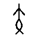
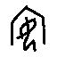

# 甲骨文未释字：我做了什么，需要你做什么

🌐 **中文**　|　[**English**](README.en.md)

---

## 一句话

我本来想考释甲骨文未释字，**没考出来**；但我发现 `OBIMD` 这个数据集标的"未释字"**大部分是标错的**，
现在需要懂甲骨文的人帮我确认两件事。

---

## 我做了什么

### 原本的目标

考释出一个甲骨文未释字，写出达到中国文字博物馆一等奖水平的论文
（要求：甲骨→金文→篆的字形演变链 ＋ 辞例验证 ＋ 音韵通假，三类证据齐全）。

### 结果：没考出来

十三轮迭代，**一个都没考释出来**。

根本原因是**我的能力不够**：甲骨文生僻字的辨认需要长期专业训练。
我能在拓片上认出「王」「貞」「卜」这类常见字，但认不出结构复杂的生僻字——
而未释字全部是生僻字。这不是算法能替代的。

### 但顺手发现了一件事

我为了考释去比对《甲骨文合集》的释文，结果发现：

> **`OBIMD` 标记的 243 个"未释字"里，有一批《合集》早就读出它是什么字了。**

比如这一个：


`OBIMD` 说它是未释字。但《合集》17382 的释文写的是：

> 鼎（貞）：…二月**娩**，不其…生。

**它就是「娩」。** 之所以在 `OBIMD` 里成了未释字，是因为**甲骨文「娩」的写法没进 Unicode**，
这个数据集没法给它编码，只好标成"无隶定"。

而且更明显的一点：`OBIMD` **在别的地方 18 次都把这句话认作「娩」**，
唯独在 17382 这片标成未释字——**这是数据集自己前后不一致**。

---

## 我具体确认了 9 个这样的例子

每一个我都拿《合集》的**原片释文**逐字比对过（不用任何自动对齐），
要求三条同时满足：①《合集》给出一个能读的字；② 两边除目标字外逐字吻合；③ 左右邻字完全一致。

| # | 数据集说是未释字 | 实际是 | 片号 | 《合集》原文 |
|---|---|---|---|---|
| 1 |  | **娩** | 17382 | 鼎（貞）：…二月**娩**，不其…生。 |
| 2 |  | **西** | 31983 | 丁酉卜：亞畢（以）眾涉于**西**，若。 |
| 3 |  | **宓** | 32009 | 庚午卜：**宓**芻示千。 |
| 4 |  | **丘** | 22454 | 叀（惠）**丘**豕于天。 |
| 5 |  | **龜** | 33286 | 乙巳鼎（貞）：叀（惠）**龜**先伐。 |
| 6 |  | **黃** | 553 | 癸丑卜，𡧊（賓）鼎（貞）：令彗、𠅅以**黃**執。七月。 |
| 7 |  | **安** | 5373 | 癸酉卜，爭鼎（貞）：王腹不**安**，亡𢓊（延）。 |
| 8 |  | **豲** | 32513 | 癸未鼎（貞）：叀（惠）今乙酉又歲于且（祖）乙五**豲**。茲用。 |
| 9 |  | **豲** | 32512 | （与 32513 同文） |

**注意这 9 个字里没有一个是生僻字**——是「安」「西」「丘」「娩」这类常用字。

---

## 我发现的一个真未释字


`OBIMD` 编号 `gx21ndp7yy`，出现 **54 次**。这是我认为**真正没人认出来**的字。

**理由**：它在《合集》里出现的句式是固定的——

```
貞 王 【这个字】 叀（惠）吉
```

共 22 例。我去《合集》全库检索这个句式，**这个位置从来没有出现过任何已释字**——
全部是私用区码位（说明《合集》编者为它专门造了字）或空缺。
**也就是说，《合集》的编者也认不出它。**

我把能想到的字都比对过了，都不像：
奭、舞、木、桑、禾、米、東、朱、未、目、見、望、省、天、大、夫、文、立、余。

**我给不出读法。** 原因是：形态上最接近的是「奭」，但「奭」在卜辞里不当动词用；
而语法位置上合适的动词（賓、田、步…），形态上又都不像。这一步需要专家判断。

---

## 需要你做什么

**两件事，大概一小时。**

### 第一件：核对上面那 9 条对不对

| 你的结论 | 会怎样 |
|---|---|
| **对** | 那么这条结论就可以被引用了：**用 `OBIMD` 做未释字研究之前，必须先筛掉"数据集没编码"的字，否则问题集里混着假问题** |
| **第 X 条错了** | 我改。这是最有价值的结果 |
| **这个方法本身就有问题** | 整个仓库的可靠性要重估 |

**这是数据比对，不是考释，懂甲骨文的研究生就能看。**

### 第二件：看 `gx21ndp7yy` 这个字

| 问题 | 为什么重要 |
|---|---|
| 1. 它有**公认读法**吗？（我可能漏了） | 有的话我立刻知道答案 |
| 2. 没有的话——**材料够不够做考释**？ | 决定这事值不值得做 |
| 3. 要推进它**还缺什么**？ | 我缺的正是这个判断 |

**材料情况**：54 次、4 个字形、22 例固定套语、类组单一（专属「事何類」）、35 片、原拓已下载。

---

## 材料在哪

| 你要的东西 | 位置 |
|---|---|
| 上面 9 条的原始核对记录 | [result/verify9_direct.json](result/verify9_direct.json) |
| 对应原拓 | [data/rubbings/](data/rubbings/)（文件名＝片号补零6位） |
| `gx21ndp7yy` 完整分析 | [findings/甲骨文未释字_真候选分析_gx21ndp7yy.md](findings/甲骨文未释字_真候选分析_gx21ndp7yy.md) |
| 它的原拓核验 | [findings/甲骨文未释字_原拓核验_gx21ndp7yy.md](findings/甲骨文未释字_原拓核验_gx21ndp7yy.md) |
| 全部 243 个未释字清单 | [handoff/inventory_classified.json](handoff/inventory_classified.json) |
| 完整评审包（比本文件详细） | [handoff/README.md](handoff/README.md) |
| 全部结论报告（16 份） | [findings/](findings/) |

**反馈**：[Issues](https://github.com/gaogao94/oracle-bone-undeciphered-audit/issues)

---

## 说明：本仓库里的字形为什么是图片

甲骨文字形**不在 Unicode 里**（`OBIMD` 用私有区 U+F0000 区），**没法用文字表示**。
所以字形一律用图片显示（存放在 [glyphs/](glyphs/)）。

另外两种写法：
- `gx21ndp7yy`、`mepmffeebh` —— 数据集的内部编号，用来指代字形
- `⟨▢⟩` —— 释文里站点自造的私有码位，我这里没有对应图片

---

## 附：我还试过什么（都失败了）

写在这里以免后来者重复：

| 尝试 | 结果 |
|---|---|
| 七套字形相似度度量（IoU、余弦、投影、网格、部件、分块…） | **全部无判别力**。同字不同形的 IoU（中 0.151、史 0.068）与跨类最高 IoU（冊 0.241）**是同一个量级**，信号被字形内部变异淹没 |
| 用原拓切字做图像检索 | top-1 **6.0%**，低于随机 |
| 自动对齐 `OBIMD` 与《合集》 | 准确率仅 **44%**，所以本仓库不采信自动结果 |
| 「=彡」「=率」「=天」 | 三个假设**都被证伪** |

**还有一个方法学提醒**：`OBIMD` 的摹本会**把磨损处规整化**
（`gx21ndp7yy` 的中部在原拓是三角形，摹本画成了方框）。
**凡涉及字形结构判断，必须回到原拓。**

---

## 许可

本仓库原创内容采用 **CC BY-SA 4.0（署名 ＋ 相同方式共享）**。
使用时必须署名，衍生作品必须以相同许可发布。详见 [LICENSE](LICENSE)、[NOTICE.md](NOTICE.md)。

**第三方材料不在授权范围内**：《合集》释文与原拓图版、`OBIMD` 数据集、
殷契文渊字形数据、引用文献。详见 [ATTRIBUTION.md](ATTRIBUTION.md)。

## 引用

```bibtex
@misc{gaogao94_oracle_audit_2026,
  author       = {gaogao94},
  title        = {甲骨文未释字的编码缺失筛查与视觉考释尝试},
  year         = {2026},
  howpublished = {\url{https://github.com/gaogao94/oracle-bone-undeciphered-audit}},
  note         = {Licensed under CC BY-SA 4.0}
}
```
