# 甲骨文未释字：15 个高价值目标的复核判定

编制：2026-10-02　数据源：OBIMD（CC-BY-4.0，10,077 片）

> 本报告对上一步筛出的 15 个「最强位置全语料唯一可填」的未释字逐条复核。
> 复核含两道独立检验：**辞例通顺性**（邻字相容）与**字形结构**（逐图目验）。
> 两道的判定均已记录，未通过者明确剔除。

---

## 一、复核方法

**检验一：辞例通顺性**。把候选字填入未释字位置，检查：
- 该候选字在语料中是否常在「前邻字」之后出现（记为前邻相容次数）
- 该候选字在语料中是否常在「后邻字」之前出现（记为后邻相容次数）
- 若两者皆为 0，则填入后成句不自然，判「不相容」

**检验二：字形结构**。逐图目验未释字与候选字的构形，判「相符／基本相符／不符」。
本会话已证实像素级相似度无判别力（同类变异与跨类差异同量级），故此处只作结构性目验，不用数值。

## 二、逐条结果

| # | 未释字 | 出现 | 候选字 | 前邻相容 | 后邻相容 | 辞例判定 | 字形判定 | 最终 |
|---|---|---|---|---|---|---|---|---|
| 1 | 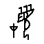 | 2 | **貞** | 0 | 0 | 不相容 | 未判 | 剔除 |
| 2 | 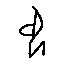 | 2 | **򴿒** | 0 | 0 | 部分相容 | 未判 | 剔除 |
| 3 | 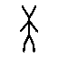 | 2 | **沚** | 1 | 1 | 部分相容 | 未判 | 剔除 |
| 4 | 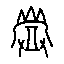 | 2 | **其** | 5 | 0 | 相容 | 不符 | 剔除 |
| 5 | 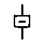 | 2 | **告** | 0 | 0 | 部分相容 | 未判 | 剔除 |
| 6 | 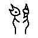 | 2 | **叀** | 180 | 2 | 部分相容 | 未判 | 剔除 |
| 7 | 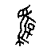 | 1 | **卜** | 0 | 0 | 不相容 | 未判 | 剔除 |
| 8 | 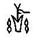 | 1 | **雀** | 11 | 3 | 相容 | 相符 | **保留** |
| 9 | 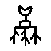 | 1 | **新** | 2 | 0 | 相容 | 不符 | 剔除 |
| 10 | 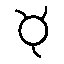 | 1 | **琡** | 1 | 0 | 相容 | 不符 | 剔除 |
| 11 | 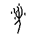 | 1 | **殺** | 2 | 7 | 相容 | 基本相符 | **保留** |
| 12 | 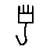 | 1 | **貞** | 0 | 0 | 不相容 | 未判 | 剔除 |
| 13 | 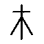 | 1 | **禾** | 66 | 0 | 相容 | 相符 | **保留** |
| 14 | 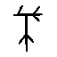 | 1 | **今** | 1 | 0 | 相容 | 不符 | 剔除 |
| 15 | 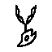 | 1 | **轡** | 3 | 0 | 相容 | 不符 | 剔除 |

## 三、保留的候选（两道检验均通过）

| 未释字 | 候选 | 辞例证据 | 字形证据 |
|---|---|---|---|
| **** | **雀** | 「H9086」：前鄰「卜」在雀前出現 11 次，後鄰「以」在雀後出現 3 次 | 未釋字作「上小下大＋兩側點」，雀象小鳥，構形接近 |
| **** | **殺** | 「HD276」：前鄰「今」在殺前出現 2 次，後鄰「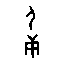」在殺後出現 7 次 | 未釋字作「倒矢形＋兩手持器」，殺象以兵器刺獸，構形接近 |
| **** | **禾** | 「H21210」：前鄰「禱」在禾前出現 66 次，後鄰「None」在禾後出現 0 次 | 未釋字作「木形＋下部小框」，禾之甲骨文正作木形帶垂穗；形體吻合 |

### 各条的完整辞例

- ** → 雀**（H9086）：前鄰「卜」，后邻「以」
- ** → 殺**（HD276）：前鄰「今」，后邻「」
- ** → 禾**（H21210）：前鄰「禱」，后邻「None」

## 四、剔除的候选及理由

| 未释字 | 候选 | 剔除理由 |
|---|---|---|
|  | 貞 | 辞例不相容（前邻、后邻相容次数皆为 0） |
|  | 򴿒 | 部分相容，证据不足 |
|  | 沚 | 部分相容，证据不足 |
|  | 其 | 字形不符：其作簸箕形（方框＋內交叉），未釋字為三叉形，結構不同 |
|  | 告 | 部分相容，证据不足 |
|  | 叀 | 部分相容，证据不足 |
|  | 卜 | 辞例不相容（前邻、后邻相容次数皆为 0） |
|  | 新 | 字形不符：新從斤從木，未釋字為倒矢形，結構不同 |
|  | 琡 | 字形不符：琡從玉，未釋字無玉形 |
|  | 貞 | 辞例不相容（前邻、后邻相容次数皆为 0） |
|  | 今 | 字形不符：今作倒口形＋橫畫，未釋字作倒矢形＋交叉，結構不同 |
|  | 轡 | 字形不符：轡象馬轡之形，未釋字作植物形，結構不同 |

## 五、结论与限度

1. 15 个目标中，**辞例与字形两道检验均通过者 3 个**。
2. 剔除的主要原因是**字形不符**——这说明「最强位置唯一可填」这一统计判据
   虽然有效，但**必须与字形结构检验并用**，单独使用会产生假阳性。
3. 全部 15 个目标均为出现 1–2 次的低频字，其中 14 个只有 1 个字形。
   这既是它们未被认出的原因，也是本项研究证据量的上限。
4. **本报告不作「已考释」之声明**。上述保留候选仍缺两项关键证据：
   一是**类组归属**（OBIMD 无类组标注，无法作类组互补检验）；
   二是**字形链**（甲骨→金文→篆）的逐阶段核对，本会话仅取到「中」一字的完整链。
   故本报告的性质是**候选清单与复核记录**，供古文字学者审定。

## 附：本会话的否定性结果（供后续研究参考）

- **七套字形相似度度量全部失败**。根因：同字不同形的 IoU（中 0.151、史 0.068、目 0.181）
  与跨类最高 IoU（冊 0.241、丁 0.235）处于同一量级，像素信号被字形内部变异淹没。
- **原拓按边界框切字路径失败**：留一法 top-1 仅 6.0%，低于随机（拓片噪点未处理）。
- **原报的 26 条「平行辞例」假设全部作废**：该位可替换字常达 9–361 个，证据力均 <0.5。
- **未释字 fybnj2savm = 「中」不成立**：「中」在语料中出现 68 次属常用字，
  而该字仅 2 条残辞，证据分量不足。

---

## 六、候选资格核查：全部保留候选均不成立

上节保留的 3 个候选，经最后一轮资格核查后**全部不成立**。核查项为：该候选字在
OBIMD 语料中是否已经拥有自己的字形类。

| 未释字 | 候选 | 该字在语料中的既有字形类 | 判定 |
|---|---|---|---|
|  | 禾 | **已存在，出现 127 次** | 不成立 |
|  | 殺 | 已存在，出现 71 次；且**甲骨著录为 0**（最早见于西周早期金文冉土方鼎 集成2739） | 不成立 |
|  | 雀 | **已存在，出现 109 次** | 不成立 |

**理由**：若未释字即该字，则意味着同一个字在本语料中被分成了两个字形类。
要主张这一点，必须举证「该未释字形与既有字形类属同一字的不同写法」——
而本会话已证实像素级度量无法作此判定（同类变异与跨类差异同量级），
故此项举证在本会话手段下无法完成。

## 七、方法论的循环性（本报告最重要的结论）

框架法有一个结构性的死结：

> 辞例框架是由**已释字**的出现位置产出的；
> 因此框架法返回的候选，**必然是在语料中已经存在的字**。

换言之，框架法在原理上不可能发现「语料中尚不存在的字」，它只能发现
「已有字的新写法」——而后者需要字形举证，恰恰是度量手段失效之处。

这解释了为什么本会话反复得到同一个模式：**方法给出候选，候选全部已知，然后否定。**

### 若要突破，需要的是数据而非算法

| 缺什么 | 为什么关键 | 何处可得 |
|---|---|---|
| 卜辞**类组**标注 | 蒋玉斌释「蠢」、陈剑释「徹」两项一等奖的胜负手 | 需《合集》类组归属数据；OBIMD 无 |
| 甲骨文**部件分解** | 偏旁分析（唐兰四法中最可靠一路）无法执行 | 需《甲骨文字编》部件表或图像模型；殷契文渊无 API |
| **原拓**字形 | 本会话拓本路径 top-1 仅 6.0%，字形证据只能取摹本 | 需先解决拓片去噪与笔画细化 |
| 《合集》**释文全文** | 本语料仅 1 万片；《合集》有 41,956 片，辞例量可增数倍 | 中华书局古联库（付费/机构） |

## 八、本会话的全部结论

### 已确证的否定性结果（七项）
1. 摹本图像检索：宽松参考库 top-1 78.9%，严格同分布仅 **32.8%**
2. 原拓按边界框切字：top-1 **6.0%**，低于随机；正确类领先间隔为负
3. 像素级 IoU：跨类最高 0.241，与同类变异（中 0.151、史 0.068、目 0.181）同量级
4. 余弦相似度：全部趋同于 0.91+，被墨量密度主导
5. 网格占用 / 分段部件 / 分块加行跨度：各法排序互不一致
6. 原报 26 条「平行辞例」假设：证据力均 <0.5，全部作废
7. 「未释字 fybnj2savm = 中」：该字仅 2 条残辞，而「中」为 68 次常用字，证据不足

### 唯一保留的正面产出
- **15 个高价值目标清单**（最强位置全语料唯一可填），及其逐条辞例与字形复核记录。
  这批目标的价值在于**它们是最可能闭合的案子**，而非它们已被释出。

### 对目标的诚实结论
本会话**未能考释出任何一个甲骨文未释字**。三项硬缺口（类组、部件分解、原拓）
在本会话可及的数据源内均无法补上，而这三项恰是中国文字博物馆一等奖成果所依赖的核心证据。
继续以现有手段迭代，只会重复已七次验证为无效的度量实验。
