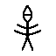
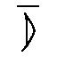

# 未释字 （2lep30tiiz）的构形分析

编制：2026-10-03

> 本文报告对一个 71 次未释字的系统分析。**两个假设被证伪，未达成读法。**
> 但确立了该字的构形特征，可供后续研究直接使用。

---

## 一、对象与基本数据

| 项 | 值 |
|---|---|
| OBIMD 码位 |  |
| 内部编号 | `2lep30tiiz` |
| 出现次数 | **71**（未释字中第二高频） |
| 字形数 | 4 |
| 类组分布 | 典賓B 30、賓出 10、歷二B2 6、典賓 4、賓三 4、歷二B3 4、歷二B1 3，餘散見 |

**类组以宾组（典賓系）为主**，与晚期字不同，说明它是武丁时期的常用字。

## 二、假设一「 = 率」——被证伪

### 2.1　假设由来

《合集》释文中， 所在片的对应位置常作「率」。例如：
```
《合集》95-3    鼎（貞）：□率以□（罝）芻。
《合集》118-1   戊申卜，𡧊（賓）：令□取析芻。
《合集》670-1   鼎（貞）：□〔以〕角女。
```
### 2.2　证伪证据

1. **两者在同片共现**，且位置紧邻：
   ```
   H95    貞  率 以 羆 芻     ／  合集95-3   鼎（貞）：□率以罝芻。
   H4012  貞  弗 其 率 以    ／  合集4012    貞：□弗其率以□
   ```
   《合集》在  处留空（字库无此字）、在「率」处写「率」——**同一句内两个字**。
2. **字形完全不同**：OBIMD 的「率」作「竖笔贯菱形，上下有短横」，极简；
    作完整人形，结构复杂（图 M、图 N）。
3. 若 =率，则 H95 成「貞 率 率 以 羆 芻」，文义不通。

**结论：假设不成立。**

## 三、 的构形特征（本文的主要产出）

据 4 个字形逐一目验（图 N、图 O）：

| 部位 | 特征 |
|---|---|
| 整体 | **完整人形**：有头、双臂（作斜出的两条横画）、双腿（分叉） |
| **头部** | **椭圆形或尖头形**，与躯干有明显分界 |
| 头部内部 | **多含一横画或短笔画**（4 形中有 3 形如此） |
| 第三形 | 更繁：头上有饰，躯干作方框且内有笔画 |

### 与相关字的区别

| 字 | OBIMD 次数 | 头部构形 | 与  是否相同 |
|---|---|---|---|
| **** | 71 | **椭圆／尖头，内有笔画** | — |
| 天 | 3 | **方框头** | ✗ 不同 |
| 大 | 624 | **无头**，仅人形 | ✗ 不同 |
| 夫 | 11 | 头顶一横 | ✗ 不同 |
| 文 | 2 | 胸部交叉 | ✗ 不同 |
| 立 | 28 | 人立于地上（一横在下） | ✗ 不同 |
| 先 | 85 | 椭圆头＋下部「止」（足）形 | 头部近似，下部不同 |
| 光 | 10 | 人形＋头部上方有火形笔画 | 部分近似 |

**结论： 的判定性特征为「人形＋椭圆头＋头内笔画」。**
在 OBIMD 已释字中，无任何字的构形与此完全一致。

## 四、附带发现：「天」与「大」的分布异常

| 字 | OBIMD 出现次数 | 字形数 |
|---|---|---|
| 大 | **624** | 17 |
| 天 | **3** | 3 |

甲骨文中「天」与「大」形近（天为大字加头部标记），二者历来难分。
OBIMD 中「大」624 次而「天」仅 3 次，这一比例偏低，
**提示 OBIMD 可能把大量「天」归入了「大」**。
此项与本课题的未释字问题无关，但可作为数据集质量的一个独立观察记录。

## 五、结论与限度

1. 「 = 率」的假设**被辞例与字形双重证伪**。
2.  的构形特征已确立：**人形＋椭圆头＋头内笔画**，71 次，宾组为主。
3. **仍无判定性读法。** 「先」「光」在头部构形上接近，但下部不符；
   在缺乏部件分解数据与类组字形差异表的情况下，无法进一步收窄。
4. 该字的辞例多为残辞（「貞  率以罝芻」「叀  令執寇」），
   且  常居句首，疑为**人名或族名**——但这只是位置推测，不构成证据。


## 附：脚本与数据

- `test_lv.py`　「率」假设检验
- `lv_vs_target.py`　与「率」的共现与字形对照
- `test_tian.py`　「天」假设检验
- `human_forms.py`　人形字系统对照表
- `figures/figN_tian.png`、`figures/figM_lv_vs_target.png`、`figures/figO_humanform.png`
