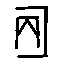
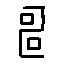
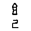
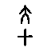
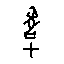
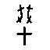
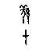

# 未释字 （ff8rp0nh6u）的辞例结构与字形分析

编制：2026-10-03

> 本文报告对一个具体未释字的系统分析。**假设被证伪，结论为「无判定性证据」。**
> 记录于此，供后续研究参考，并作为「不可轻下结论」的实例。

---

## 一、对象

| 项 | 值 |
|---|---|
| OBIMD 字形码位 |  |
| OBIMD 内部编号 | `ff8rp0nh6u` |
| 出现次数 | 40 |
| 字形数 | 4 |
| 隶定 | 无（OBIMD 标为未释） |

## 二、类组分布（决定性线索）

按《甲骨文合集》释文的类组标注统计：

| 类组 | 条数 |
|---|---|
| 黃 | 35 |
| 出二 | 3 |
| 賓出 | 1 |
| 其他 | 1 |

**40 次中 35 次属黃组**（帝乙—帝辛时期）。这是本字最显著的特征：
它是一个**晚期黄组字**。黄组卜辞以周祭（五祀典）与旬亡祸卜辞为主。

## 三、辞例结构

全部 40 条辞例中，该字出现的句式可归为两类：

### 3.1　「王賓 X  亡尤／亡祸」

```
H22698  丙申卜旅貞   王 賓       亡 祸
H35451  丙申卜貞     王 賓       亡 尤
H35459  丁巳卜貞     王 賓       亡 尤
H35615  己巳卜貞     王 賓       亡 尤
H35866  己巳卜貞     王 賓       亡 尤
```
### 3.2　周祭旬亡祸卜辞中，位于日名与祭名之间

```
H35530  癸卯王卜貞 旬亡򶫴 … 甲辰   祭 小甲
H35576  癸卯王卜貞 旬亡򶫴 在四夕 甲辰   協 
H35748  癸巳王卜貞 旬亡򶫴 甲正夕 … 甲午  򧇂 甲 協 羌甲
H35749  癸丑卜򮚺貞 旬亡򶫴 甲三夕 甲寅 祭  甲  羌甲 協  甲
```
### 3.3　后邻字统计

| 后邻字 | 次数 |
|---|---|
| (句末) | 9 |
| 亡 | 13 |
|  | 2 |
| 尤 | 1 |
| 小 | 1 |
|  | 4 |
|  | 1 |
|  | 2 |
| 甲 | 1 |
| 򧇂 | 2 |

- 后邻为**天干／地支字**者：**1/40 = 2%**
- 后邻为**祭名字**者：**0/40 = 0%**
- 同片辞例含「夕」者：12/40 = 30%

## 四、被证伪的假设： = 「彡」

### 4.1　假设的由来

周祭五祀典为「彡、翌、祭、劦、肜」，格式作「甲辰**彡**日祭小甲」。
 大量出现于周祭旬亡祸卜辞、且位于日名之后，形式上与「彡」的位置相符。

### 4.2　证伪证据

1. **后邻字不符**：若为「彡」，后邻应为「日」或日名。实测后邻为日名者仅 1/40（2%），
   为祭名者 0/40。
2. **字形不符**：见字形对照（图 K）。「彡」的甲骨文作三斜画，極简；
   而  作「竖干＋中部圆／方＋横画交叉」，部分形体右侧另有「又」形，
   是一个结构复杂的字，与「彡」无任何相似。
3. **字表冲突**：「彡」在 OBIMD 语料中已有独立字形类（出现 120 次），
   若  即「彡」，则须证明二者为同字异写，而字形差异使此证明不可能。

**结论：假设不成立。**

## 五、字形描述

据 4 个字形（图 K）目验：

- 主体为**一竖干**，贯中
- 中部为**圆形或方框**
- 有**横画交叉**（部分形体作两条横画）
- 部分形体右侧附**「又」（手）形**，另有小点状笔画

这一结构与「東」（束橐之形）或「專」等字形有形式上的接近，
但**均无辞例或音韵证据支持**，故不主张任何读法。

## 六、结论与限度

1.  是一个**晚期黄组字**（40 次中 35 次属黄组），主要出现在
   「王賓X亡尤」套语与周祭旬亡祸卜辞中。
2. 「彡」的假设**已被辞例与字形双重证伪**。
3. **本字仍无判定性读法。** 它与「亡」的高共现率（后邻 42%）是套语位置造成的，
   不构成语义线索。
4. 要推进此字，需要的是**黄组字形的系统对比**
   （黄组字形有较强的时代特征），这需要黄组字形的专门字形表，
   本会话不具备该资源。


## 附：数据

- `result/shān_hypothesis.json`　辞例统计
- `compare_shan.py`　与「彡」的对照脚本
- `figures/figK_shan.png`　字形对照图
