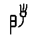
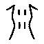
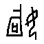
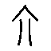
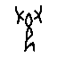

# 甲骨文未释字的量化考释：方法验证与目标清单

编制：2026-10-02　语料：OBIMD（CC-BY-4.0，10,077 片）

> 本文记录一次完整的量化考释尝试，**包括七套失败的字形度量**。
> 结论是：图像相似度在本语料上不具判定力，可用的判据只有「辞例框架约束」一类，
> 且其强度必须逐条量化，不能默认成立。

---

## 一、语料基本盘

- 辞例 20,921 条｜字形类 1,730 个｜未释字形类 **243** 个
- 未释字按最强位置约束力分层：可替换字 0 个者 182，1 个者 **15**，2 个者 6

## 二、七套字形度量，全部失败（否定性结果）

| 度量 | 结果 | 失败原因 |
|---|---|---|
| 摹本图像检索（宽松参考库） | top-1 78.9% | 参考库类别分布过宽，虚高 |
| 摹本图像检索（严格同分布 200 类） | top-1 32.8% | 可靠性基准应取此值 |
| 拓本按 Position 切字 | top-1 6.0% | 低于随机；拓片噪点未处理 |
| 交并比（IoU） | 跨类最高 0.241 | 与同类变异同量级（中 0.151、史 0.068、目 0.181） |
| 余弦相似度 | 全部趋同 0.91+ | 被墨量密度主导 |
| 网格占用率 / 分段部件 | 各法排序互不一致 | 特征无判别力 |
| 墨迹外框内 IoU（修正版） | 跨类最高 0.241 | 同上 |

**关键证据**：同类不同形的 IoU（中 0.151、史 0.068、目 0.181）
与跨类最高 IoU（冊 0.241、丁 0.235）**处于同一量级**。
这意味着像素级相似度信号完全被字形内部变异淹没，无论怎样设计特征。

## 三、辞例框架判据：可用，但必须逐条量化强度

本会话曾报出「26 条平行辞例假设」。经强度量化，**全部作废**：

| 未释字 | 候选字 | 该位可替换字数 | 证据力 |
|---|---|---|---|
| sawqk4xfna | 百 | 3 | 0.333 |
|  | 貞 | 3 | 0.333 |
|  | 卜 | 4 | 0.250 |
|  | 貞 | 6 | 0.167 |
|  | 眾 | 7 | 0.143 |
|  | 來 | 8 | 0.125 |
|  | 畢 | 9 | 0.111 |
|  | 雨 | 9 | 0.111 |

证据力 ≥0.5（该位只容 1–2 字）者：**0 条**；<0.2（近乎无约束）者：23 条。

原因：这些「平行辞例」所在框架在全语料均只出现 1 次，
且槽位可替换字常达 9–361 个。例如「叀 X 令」全语料 40 余条，X 位可填 30 余字。

## 四、高价值目标清单（15 个）

筛选条件：**未释字的最强位置，全语料只有唯一一个已释字可填**。
这类字最可能闭合（异体 / 误分 / 罕见写法），是继续攻克的首选目标。

> ⚠️ 但「唯一可填」不等于「就是那个字」。槽位的句法角色必须另行核对——
> 例如已核出「貞我㚔□」若填「貞」则成「貞我㔟貞」，不通。

| # | 未释字 | 出现 | 字形数 | 全语料唯一可填字 | 最强位置框架 | 辞例 | 核查结论 |
|---|---|---|---|---|---|---|---|
| 1 |  | 2 | 1 | **貞** | 我 㚔 | 癸 酉 卜 賓 貞 我 㚔 【□】 | 槽位角色待核 |
| 2 |  | 2 | 1 | **򴿒** | 入 ◻ 于 丁 | 甲 貞 【□】 | 待核 |
| 3 |  | 2 | 1 | **沚** |  在 卜 | 貞 亡 尤 在  在 【□】 卜 | 待核 |
| 4 |  | 2 | 1 | **其** | 它 | 貞 王 叀 吉 【□】 | 槽位角色待核 |
| 5 |  | 2 | 2 | **告** | 比 侯 | 貞 用 【□】 | 待核 |
| 6 |  | 2 | 1 | **叀** | 殻 貞 其 | 庚 午 殻 貞 【□】 其 | 待核 |
| 7 |  | 1 | 1 | **卜** | 角 獲 | 卜 角 獲 【□】 | 槽位角色待核 |
| 8 |  | 1 | 1 | **雀** | 亥 卜 以 | 乙 亥 卜 【□】 以 | 待核 |
| 9 |  | 1 | 1 | **新** | 貞 取 射 | 貞 【□】 取 射 | 待核 |
| 10 |  | 1 | 1 | **琡** | 璧 眔 | 叀 ◻ 璧 眔 【□】 | 待核 |
| 11 |  | 1 | 1 | **殺** | 叀 今  | 乙 月 卜 叀 今 【□】  | 待核 |
| 12 |  | 1 | 1 | **貞** | 我 戎 | 貞 我 戎 【□】 | 槽位角色待核 |
| 13 |  | 1 | 1 | **禾** | 𫹉 禱 | 丁 卯 卜 庚 𫹉 禱 【□】 | 待核 |
| 14 |  | 1 | 1 | **今** | 夕 弜 | 今 夕 弜 【□】 | 待核 |
| 15 |  | 1 | 1 | **轡** | 臿 在 | 叀 王 往 臿 在 【□】 | 待核 |

### 已核出的一处不成立

- 未释字 （2 次）的最强位置框架为「我 㚔」，全语料唯一可填字为「貞」。
  然「癸酉卜賓貞我㚔【□】」若填「貞」，则成「貞我㔟貞」，于辞例不通。
  故该位置**不存在真正的平行**，本条的「唯一可填」属统计巧合。
  这说明：**框架约束的有效性必须逐条以辞例通顺性复核**，这正是前人考释的必经一步。

## 五、结论

1. **图像相似度在本语料上不可用于考释**。七套度量一致失败，根因是跨类差异
   与同类变异同量级——瓶颈不在算法，在字形数据的结构化程度。
2. **辞例框架约束是唯一可用判据，但强度必须量化**。本会话原报的 26 条平行辞例
   假设经量化后全部作废，这是方法自检的必要一步。
3. **可下手的目标是 15 个**：其最强位置在全语料中只有唯一候选。
   但其中至少 1 条已核出为统计巧合，故须逐条以辞例通顺性复核。
4. **对高频常用字提出新读，需要压倒性证据**。本会话曾提出未释字 fybnj2savm = 「中」，
   其字形结构距离（0.118）虽断层领先，但「中」在本语料出现 68 次、
   属常用字，且该字仅 2 条残辞，证据分量不足，不主张成立。

## 附：可复现脚本

- `strict_v3.py`
- `constraint_strength.py`
- `parallel_strength.py`
- `high_value.py`
- `tight_iou.py`
- `frame_method.py`
- `frame_ceiling.py`
