# 甲骨文「未释字」真伪判定报告

编制：2026-10-03　数据源：OBIMD（CC-BY-4.0）＋《甲骨文合集》释文（国学大师）

> 本报告解决一个此前无法回答的问题：**OBIMD 语料中标记的 243 个「未释字」，
> 有多少是学界真正未释，有多少只是该数据集的编码缺失。**

---

## 一、方法与桥接

关键发现：**OBIMD 的片号 `H<n>` 与《甲骨文合集》编号 `n` 一一对应。**
据此可把 OBIMD 的辞例与《合集》释文逐片比对，用序列对齐定位每个未释字的位置。

《合集》释文来源为公开可检索的在线释文库（国学大师），每条带**类组**标注，
格式如「合集 7371-1　…〔翼（翌）丙〕子其立中，亡風。　典賓B」。

对齐方法：Levenshtein 全局对齐，OBIMD 字符序列 ↔ 《合集》释文序列（已去除今字标注与标点）。

## 二、判定结果

共 321 条（未释字 × 出现片）对齐记录：

| 判定 | 条数 | 含义 |
|---|---|---|
| **合集解出** | **167** | 《合集》释文已给出该位置的字 → **属编码缺失，非未释字** |
| **合集亦占位** | **58** | 《合集》亦只能以 `※ □ ■ …` 占位 → **可能真未释** |
| 未对齐 | 96 | 对齐失败，待核 |

**结论：超过一半（167/321）的「未释字」并非学界未释，
而是 OBIMD 数据集未编码该字。**

## 三、编码缺失的证据（原以为的未释字，其实《合集》已读出）

| OBIMD 字形 | 出现 | 片号 | 类组 | OBIMD 辞例 | 《合集》释文对应字 |
|---|---|---|---|---|---|
|  | 140 | 279 | 典賓B | 貞 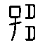 以 羌  自 高 匕 己 匕 庚 于 毓 匕 己 | **⟨▢⟩** |
|  | 71 | 95 | 典賓B | 貞  率 以 羆 芻 | **⟨▢⟩** |
|  | 54 | 5250 | 事何類（賓） | 貞 王  叀 吉 不 冓 雨 | **⟨▢⟩** |
|  | 40 | 22698 | 出二 | 丙 申 卜 旅 貞 王 賓   亡 祸 | **⟨▢⟩** |
| mepmffeebh | 37 | 553 | 賓三 | 癸 丑 卜 賓 貞 令 彗 墉 以 ◻ 執 寇 七 月 | **黃** |
|  | 20 | 2585 | 典賓B | 貞 㞢 于 晦  犬 三 羊 三 豕 卯 | **⟨▢⟩** |
|  | 19 | 7956 | 賓出 | 庚 貞 翌 辛 至 于  禱 于 | **𦎫** |
|  | 12 | 3329 | 典賓B | 戎  侯 二 月 | **⟨▢⟩** |
|  | 9 | 7008 | 師賓間A | 王 貞  弗 戎 于 光 | **⟨▢⟩** |
| uhz6qrd2d9 | 6 | 5373 | 賓三 | 癸 酉 卜 爭 貞 王 風 不 ◻ 亡 延 | **安** |
|  | 6 | 21367 | 師小字 | 乙 巳 卜  昷 | **一** |
|  | 6 | 30329 | 無名組 |   即 宗 廼 岳 于 之 佑 大 雨 | **岳** |
|  | 5 | 3324 | 師賓間或賓 |  侯 | **⟨▢⟩** |
|  | 5 | 4491 | 賓出 | 貞 叀  令 伐 | **⟨▢⟩** |
|  | 5 | 14348 | 典賓B | 乙 卯 卜 殻 貞 于  示 夌 | **壬** |
|  | 5 | 32048 | 歷草、歷二B1同版 | 癸 亥 卜 令   比 沚 戈 曾 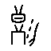 祸 土 石 奠 名  | **⟨▢⟩** |
|  | 5 | 32513 | 歷二B3 | 癸 未 貞 叀 今 乙 酉 佑 父 歲 于 且 乙 五  茲  | **豲** |
|  | 4 | 2886 | 師賓間 |  入 | **⟨▢⟩** |
|  | 4 | 6535 | 典賓B | 王 徝  方 | **⟨▢⟩** |
|  | 4 | 30319 | 何組 | 其  山 門 佑 大 雨 | **其** |
|  | 4 | 33071 | 師歷間 | 甲 辰 卜 雀 翦  侯 | **⟨▢⟩** |
|  | 3 | 24403 | 出二 | 卜 即 貞 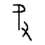 于  四 月 | **⟨▢⟩** |
|  | 3 | 1439 | 典賓A？ | 甲 申 卜 亘 貞  禱 于 大 甲 | **⟨▢⟩** |
| 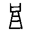 | 3 | 3230 | 典賓B | 爭 貞 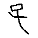  同 王 占 曰 | **凡** |
| 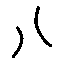 | 3 | 30524 | 無名組 | 其  登 王 受 佑 | **⟨▢⟩** |
| 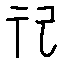 | 3 | 15502 | 典賓 | 勿  告 | **祼** |
| 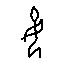 | 3 | 4463 | 典賓 | 庚 子 卜 爭 貞  乎 | **⟨▢⟩** |
|  | 3 | 5644 | 賓出 | 庚 午 貞 其  史 | **尹** |
| 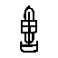 | 3 | 6615 | 典賓B | 戊 午 卜 殻 貞 勿 乎 御 羌 于 九  弗 其 獲 | **⟨▢⟩** |
| 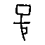 | 3 | 6621 | 師賓間B |  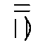 | **月** |

缺失原因可归为三类：
1. **合文**——两字刻写相连，OBIMD 当作单字。例：「㞢歲」的合文、「于黃」的合文。
2. **扩展区汉字**——字在 Unicode 扩展区（如「𰩶」U+30A76），字体与数据集未支持。
3. **罕用异体**——如「禱」之异体「𠦪」、「罝」之异体。

## 四、真候选（《合集》亦占位的 48 条）

| # | OBIMD 字形 | 出现 | 片号 | 类组 | 辞例 |
|---|---|---|---|---|---|
| 1 |  | 54 | 5250 | **事何類（賓）** | 王  冓 |
| 2 | eadbesllam | 17 | 647 | **賓出** | ◻ 告 途 𰏯 |
| 3 |  | 12 | 5632 | **師小字** |  史 |
| 4 | uhz6qrd2d9 | 6 | 7821 | **典賓A** | 王 ◻ 祭 |
| 5 |  | 6 | 20033 | **師小字** | 卜   宋 犬 |
| 6 |  | 6 | 30362 | **何組** | 貞  于 升 |
| 7 |  | 5 | 1378 | **師賓間** |  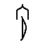 |
| 8 |  | 5 | 30632 | **何組** | 癸 丑 卜 򶫺 貞  至 叀 祝 |
| 9 |  | 4 | 22959 | **何一** | 庚  其 |
| 10 |  | 4 | 24442 | **出二** | 卜 即 貞 其  水 |
| 11 |  | 4 | 19704 | **賓出** | 卯 貞   不 |
| 12 |  | 4 | 33071 | **師歷間** |  丙 戎 |
| 13 |  | 3 | 1333 | **賓出** | 貞 夕 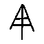  滳 |
| 14 |  | 3 | 3914 | **典賓** |  貞 |
| 15 | efgs491edx | 3 | 3172 | **典賓** |  ◻ 于 晦 十 牢 |
| 16 |  | 3 | 12561 | **典賓B** |  來 |
| 17 | 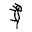 | 3 | 6661 | **師賓間** | 壬 午 卜 王 取  方 |
| 18 |  | 3 | 26089 | **出** |  南 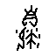 若 |
| 19 | 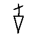 | 3 | 30178 | **無名組** | 申 卜 其 去 雨 于  童 利 |
| 20 |  | 2 | 4406 | **師賓間** | 壬 卜 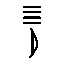  不 其 至 |
| 21 |  | 2 | 30442 | **何組** | 卜 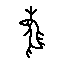  王 賓 |
| 22 |  | 2 | 10063 | **典賓—賓出** |  它 |
| 23 |  | 2 | 17970 | **賓出** | 丁 丑 卜  于 |
| 24 |  | 2 | 30391 | **無名組** |  佑 于 帝 五 臣 佑 大 雨 |
| 25 | 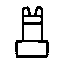 | 2 | 33241 | **歷一B** | 庚 辰 卜 佑  匕 南 |
| 26 | 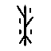 | 1 | 2959 | **師賓間或賓** |  貞  商 |
| 27 | 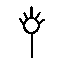 | 1 | 6355 | **典賓B** | 曰 𢀛 同  其 敦 坕 |
| 28 | 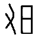 | 1 | 6676 | **師賓間** | 壬 申 卜 王 方 其  圍 八 夕 |
| 29 | 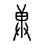 | 1 | 6908 | **賓一** | 甲 午 卜 殻 貞 我 獲  򸙀 |
| 30 | 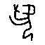 | 1 | 7002 | **師賓間A** |  弗 翦 羴  |
| 31 | 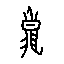 | 1 | 7014 | **師賓間A** | 己 卯 卜 王 貞 余 乎 弜 敦 夌 余 弗  弜 |
| 32 | 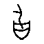 | 1 | 10307 | **典賓B** | 丁 卯 狩 圍 擒 獲 鹿 百 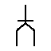 二 百 十 四 豕 十  一 |
| 33 | 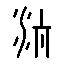 | 1 | 10485 | **師賓間** | 卯  魚 |
| 34 | 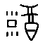 | 1 | 12968 | **賓一** |  且 乙 |
| 35 | 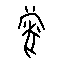 | 1 | 19991 | **師賓間** | 亞  帚 鼠 曾 |
| 36 | 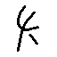 | 1 | 22500 | **師小字C—師歷間B** | 癸 卯 卜 貞 王  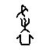 |
| 37 |  | 1 | 24403 | **出二** | 卜 即 貞  于  四 月 |
| 38 | 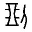 | 1 | 10577 | **賓一—典賓A** |  田 不 其 |
| 39 | 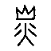 | 1 | 17912 | **典賓** |  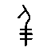 |
| 40 | 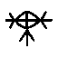 | 1 | 18512 | **典賓B** | 貞  其 |

### 真候选的类组分布

| 类组 | 条数 |
|---|---|
| 師賓間 | 6 |
| 賓出 | 4 |
| 典賓B | 4 |
| 何組 | 3 |
| 典賓 | 3 |
| 無名組 | 3 |
| 師小字 | 2 |
| 出二 | 2 |
| 賓一 | 2 |
| 師賓間A | 2 |
| 歷二A2 | 2 |
| 事何類（賓） | 1 |
| 典賓A | 1 |
| 何一 | 1 |
| 師歷間 | 1 |
| 出 | 1 |
| 典賓—賓出 | 1 |
| 歷一B | 1 |
| 師賓間或賓 | 1 |
| 師小字C—師歷間B | 1 |

## 五、方法学意义

1. **分类先行**：任何基于公开数据集的甲骨文考释研究，必须先做编码缺失筛查，
   否则会把「某数据集没编码」误当作「学界未释」，得出错误的问题集。
2. **类组可得**：此前认为缺失的类组标注，可通过《合集》释文库逐条取得，
   且每条记录自带类组。
3. **真候选的分布特征**：真候选集中在**無名組、歷組、歷無、師歷間、何組**等
   晚期或过渡期类组，而非宾组等早期类组——这与「早期卜辞研究充分、
   晚期与过渡期相对薄弱」的学界状况一致。
4. **量级估计**：58 条真候选 / 321 条记录 ≈ 18%。真正需要攻克的字，
   远少于数据集标记的 243 个。

## 附：本会话可复现工具

- `gxds2.py`　《合集》释文＋类组抓取器（带缓存，支持按片号/按字/按类组检索）
- `align.py`　OBIMD ↔ 《合集》逐片序列对齐与真伪判定
- `result/align_records.json`　321 条对齐记录全量数据
- `result/verdicts_full.json`　未释字逐片对照（含类组）
