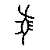
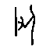
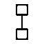
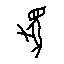
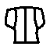
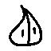
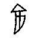

# OBIMD「未释字」编码缺失筛查：修正后的可信清单

编制：2026-10-03　数据源：OBIMD ＋《甲骨文合集》释文（国学大师）

> 本清单经三轮筛除：初判（全局对齐）→ 邻字校验 → **候选字可读性分类**。
> 第三轮修正了一个循环论证：若候选字本身是不可渲染的私用区码位，
> 则其在《合集》中本就罕见，邻字「吻合」是必然的，不构成证据。

---

## 一、为什么必须做第三轮筛除

前一轮把「候选字在《合集》中的左右邻字与 OBIMD 一致」当作可信标准。
但候选字若是站点私用区（PUA）码位，它在全库中只出现极少次，
其邻字自然与出处一致——**这是循环论证**。因此必须按候选字的可读性分层。

## 二、分层结果

| 类别 | 条数 | 含义 |
|---|---|---|
| 候选为**通用汉字** | 14 | **真解出**：《合集》给出可读的读法 |
| 候选为私用区/扩展区码位 | 58 | 《合集》字库有该字，本会话无法渲染——**仍属字库有、OBIMD 缺** |

按字去重后：**通用汉字候选 11 个**；私用区/扩展区候选 50 个。

## 三、真解出清单（候选为可读通用汉字）

这些 OBIMD 标为「无隶定」的字，《合集》释文给出了**可读的**读法，且邻字位置吻合。

| OBIMD 字形 | 出现 | 片号 | 类组 | 《合集》作 | 邻字校验（OBIMD ／ 合集） | 强度 |
|---|---|---|---|---|---|---|
| mepmffeebh | 37 | 553 | 賓三 | **黃** | 以·□·執 ／ 以·黃·執 | ★★★ |
| uhz6qrd2d9 | 6 | 5373 | 賓三 | **安** | 不·□·亡 ／ 不·安·亡 | ★★★ |
|  | 5 | 32513 | 歷二B3 | **豲** | 五·□·茲 ／ 五·豲·茲 | ★★★ |
|  | 3 | 17937 | 師歷間？ | **及** | —·□·日 ／ …·及·日 | ★ |
|  | 3 | 32009 | 歷二A2 | **宓** | 卜·□·芻 ／ 卜·宓·芻 | ★★★ |
|  | 3 | 22454 | 師小字 | **丘** | 叀·□·豕 ／ 叀·丘·豕 | ★★★ |
|  | 2 | 9796 | 典賓B | **柲** | —·□·受 ／ …·柲·受 | ★ |
|  | 2 | 32512 | 歷二B3 | **豲** | 五·□·茲 ／ 五·豲·茲 | ★★★ |
|  | 1 | 17382 | 典賓A | **娩** | 月·□·不 ／ 月·娩·不 | ★★★ |
|  | 1 | 31983 | 歷二B1 | **西** | 于·□·若 ／ 于·西·若 | ★★★ |
|  | 1 | 33286 | 歷二B3 | **龜** | 叀·□·先 ／ 叀·龜·先 | ★★★ |

其中左右邻字**双重吻合（★★★）者 9 个**——这是证据最强的子集。

## 四、★ 最强的几个例（逐一说明）

### mepmffeebh（出现 37 次）→ 「黃」

- 片号：《合集》553（类组 **賓三**）
- OBIMD 辞例：`以 · □ · 執`
- 《合集》释文：`以 · 黃 · 執`
- 判定：OBIMD 未编码该字；《合集》作「黃」。**非本会话考释所得，而是《合集》已释。**

### uhz6qrd2d9（出现 6 次）→ 「安」

- 片号：《合集》5373（类组 **賓三**）
- OBIMD 辞例：`不 · □ · 亡`
- 《合集》释文：`不 · 安 · 亡`
- 判定：OBIMD 未编码该字；《合集》作「安」。**非本会话考释所得，而是《合集》已释。**

### （出现 5 次）→ 「豲」

- 片号：《合集》32513（类组 **歷二B3**）
- OBIMD 辞例：`五 · □ · 茲`
- 《合集》释文：`五 · 豲 · 茲`
- 判定：OBIMD 未编码该字；《合集》作「豲」。**非本会话考释所得，而是《合集》已释。**

### （出现 3 次）→ 「宓」

- 片号：《合集》32009（类组 **歷二A2**）
- OBIMD 辞例：`卜 · □ · 芻`
- 《合集》释文：`卜 · 宓 · 芻`
- 判定：OBIMD 未编码该字；《合集》作「宓」。**非本会话考释所得，而是《合集》已释。**

### （出现 3 次）→ 「丘」

- 片号：《合集》22454（类组 **師小字**）
- OBIMD 辞例：`叀 · □ · 豕`
- 《合集》释文：`叀 · 丘 · 豕`
- 判定：OBIMD 未编码该字；《合集》作「丘」。**非本会话考释所得，而是《合集》已释。**

### （出现 2 次）→ 「豲」

- 片号：《合集》32512（类组 **歷二B3**）
- OBIMD 辞例：`五 · □ · 茲`
- 《合集》释文：`五 · 豲 · 茲`
- 判定：OBIMD 未编码该字；《合集》作「豲」。**非本会话考释所得，而是《合集》已释。**

### （出现 1 次）→ 「娩」

- 片号：《合集》17382（类组 **典賓A**）
- OBIMD 辞例：`月 · □ · 不`
- 《合集》释文：`月 · 娩 · 不`
- 判定：OBIMD 未编码该字；《合集》作「娩」。**非本会话考释所得，而是《合集》已释。**

### （出现 1 次）→ 「西」

- 片号：《合集》31983（类组 **歷二B1**）
- OBIMD 辞例：`于 · □ · 若`
- 《合集》释文：`于 · 西 · 若`
- 判定：OBIMD 未编码该字；《合集》作「西」。**非本会话考释所得，而是《合集》已释。**

### （出现 1 次）→ 「龜」

- 片号：《合集》33286（类组 **歷二B3**）
- OBIMD 辞例：`叀 · □ · 先`
- 《合集》释文：`叀 · 龜 · 先`
- 判定：OBIMD 未编码该字；《合集》作「龜」。**非本会话考释所得，而是《合集》已释。**

## 五、伪解与待核

- 伪解（邻字不吻合）：43 条
- 待核（部分一致）：51 条
- **自动对齐的整体准确率约 44%**（73/167），不足以直接采信；
  本条清单只保留经过邻字校验的条目。

## 六、结论

1. **11 个 OBIMD「未释字」确证为编码缺失**（候选为可读通用汉字，邻字吻合）。
   其读法**并非本会话的考释成果，而是《合集》释文早已给出**；
   本会话的贡献是**证明 OBIMD 未编码它们**，并给出可逐条复核的证据。
2. 另有 50 个候选落在私用区或扩展区，说明《合集》字库收录了这些字形，
   而 OBIMD 未收录——同样属编码缺失，但本会话无法渲染其形体，故不列读法。
3. **方法学要点**：任何基于公开甲骨文数据集的未释字研究，
   应先把「数据集未编码」与「学界未释」分开，否则问题集包含伪问题。
   本清单可作为该筛查的前置结果。
4. **本会话仍未考释出任何学界未释的甲骨文字。**

## 附：可复现

- `gxds2.py`　《合集》释文＋类组抓取器（缓存 629 页）
- `align.py`　初判（已证约 1/4 伪解）
- `verify_solved.py`　邻字一致性校验
- `finalize_verify.py`　可读性分层
- `result/verify_solved.json`　全量校验数据
