# 甲骨文未释字交接清单

编制：2026-10-03

> **本清单的目的是交接，不是考释。** 它把公开数据集中标记为
> 「未释」的甲骨文字形，连同其原拓、辞例、类组一并整理，
> 供具备古文字学训练的研究者直接接手。

---

## 一、清单规模

| 项 | 数量 |
|---|---|
| 未释字形类 | **243** |
| 涉及甲骨片 | **690** |
| 已下载原拓 | **322 片** |
| 数据源 | OBIMD（CC-BY-4.0）＋《甲骨文合集》释文 |

## 二、类组分布（按字计）

| 类组 | 字数 |
|---|---|
| 典賓B | 27 |
| 賓出 | 23 |
| 師小字 | 22 |
| 典賓 | 13 |
| 師賓間 | 13 |
| 出二 | 10 |
| 無名組 | 10 |
| 賓一 | 8 |
| 何組 | 8 |
| 歷二B3 | 5 |
| 賓三 | 5 |
| 歷二B1 | 4 |
| 非王圓體類和劣體類 | 4 |
| 歷二B2 | 4 |
| 歷一B | 3 |
| 師賓間A | 3 |
| 典賓A | 3 |
| 師肥筆 | 3 |
| 事何類 | 2 |
| 歷草、歷二B1同版 | 2 |
| 典賓B晚 | 2 |
| 師賓間B | 2 |
| 師小字C—師歷間B | 2 |
| 出一 | 2 |
| 歷二C2 | 2 |

## 三、按出现次数分层

### ≥10 次：11 个

| 字形 | 出现 | 片号 | 类组 | 《合集》释文 |
|---|---|---|---|---|
| 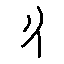 | 140 | 1343 | 賓一 | □卯㞢⟨▢⟩歲成。 |
|  | 71 | 107 | 典賓B | …⟨▢⟩來芻… …弗其■… …我… |
| 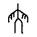 | 54 | 15829 | 事何類 | 05291 |
| 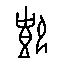 | 40 | 22698 | 出二 | 丙申卜，旅鼎（貞）：王⟨▢⟩（賓）匚丙⟨▢⟩，亡𡆥（憂）。 |
| mepmffeebh | 37 | 14038 | 典賓B | 鼎（貞）：小臣娩，⟨▢⟩。 □□〔卜〕，𡧊（賓）鼎（貞）：黃… |
| 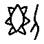 | 26 | 18451 | 出二 | 庚戌〔卜〕，□鼎（貞）：今日… 十一月。〔才（在）〕⟨▢⟩。 |
| 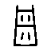 | 20 | 14331 | 典賓B | …東，⟨▢⟩… …西，⟨▢⟩犬，尞（燎）白□、幽□。 …〔羊，卯〕。 |
| 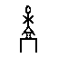 | 19 | 16986 | 典賓B | …求（咎？）…⟨▢⟩…⟨▢⟩… |
| eadbesllam | 17 | 20575 | 師小字 | ⟨▢⟩。 鼎（貞)：凡追。 專南。 鼎（貞)：凡追。 三 禾。 曰⟨▢⟩。 |
| 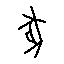 | 13 | — |  | — |
| 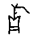 | 12 | 20599 | 師小字 | 04936 |

### 3–9 次：43 个

| 字形 | 出现 | 片号 | 类组 | 《合集》释文 |
|---|---|---|---|---|
| 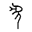 | 9 | 14367 | 典賓B | …𠦪（禱）…夒。一月。 …⟨▢⟩… 二 |
| 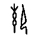 | 7 | — |  | — |
| uhz6qrd2d9 | 6 | 15404 | 典賓 | …鼎（貞）：乎（呼）…子安… …用… |
| 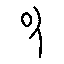 | 6 | 20022 | 師小字 | 戊午卜，⟨▢⟩：㞢小王。 |
| 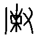 | 6 | 30329 | 無名組 | …岳*于之，又（有）大雨。 …既※小山…岳*即宗廼…岳*來于之，又（有）大雨。 |
| 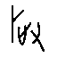 | 6 | — |  | — |
| 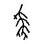 | 5 | 1378 | 師賓間 | …⟨▢⟩。六月。 庚子〔卜〕，鼎（貞）：㞢〔于〕成… |
| 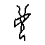 | 5 | 33091 | 歷二B3 | □□鼎（貞）：…令⟨▢⟩…取壴⟨▢⟩…白，㚔。三月 |
| 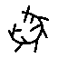 | 5 | 14348 | 典賓B | 乙卯卜，㱿鼎（貞）：于⟨▢⟩壬〔𠦪（禱）〕。 三 （“壬”為“示”字誤） |
| 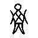 | 5 | 30632 | 何組 | 癸丑卜，犾鼎（貞）：※至叀（惠）…祝。 …王…⟨▢⟩…蔡（？）… |
| 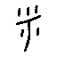 | 5 | 32048 | 歷草、歷二B1同版 | 辛… 辛〔酉〕…帚（歸）沚〔戈〕。 辛酉叀（惠）甫令。 于癸令。 癸亥卜：令⟨▢⟩⟨▢⟩比沚戈※𡆥（憂）土石奠名任。 …令…尸（ |
|  | 5 | 32049 | 歷草 | …甫…令。 辛酉于癸令。 一 丙寅又伐于司⟨▢⟩三十⟨▢⟩（羌），卯三十豲。 一 一 一 |
| 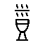 | 5 | — |  | — |
| 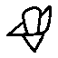 | 4 | 2886 | 師賓間 | □□卜：…⟨▢⟩兄丁。 ⟨▢⟩入。 （甲尾刻辭） |
| 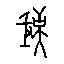 | 4 | 4419 | 典賓 | …示⟨▢⟩… |
| 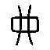 | 4 | 6535 | 典賓B | …王徝⟨▢⟩方，受〔㞢（有）又（祐）〕。 |
| 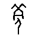 | 4 | 6544 | 典賓B | …伐⟨▢⟩方，受〔㞢（有）又（祐）〕。 …■⟨▢⟩⟨▢⟩〔方〕… |
| 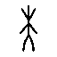 | 4 | 30319 | 何組 | 鼎（貞）：王其酒夒于又宗，又（有）大雨。 其𠦪（禱）※，又（有）大雨。 |
| 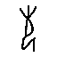 | 4 | 18099 | 師小字—師賓間 | …貝…其敖（？）。 辛卯…帚（婦）亡…𦔻（聽）。十一月。 |
| 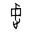 | 4 | 24131 | 出二 | □寅卜，即〔鼎（貞）〕：王其⟨▢⟩… |
| 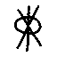 | 4 | 19704 | 賓出 | 辛卯卜，□鼎（貞）：■…■子…■⟨▢⟩（𥞥）…不… |
| 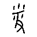 | 4 | 33071 | 師歷間 | …⟨▢⟩…丙…戎…。 甲辰卜：侯⟨▢⟩雀。 一 甲辰卜：雀受侯又（佑）。 一 甲辰卜：雀⟨▢⟩（翦）⟨▢⟩侯。 二 □辰卜：⟨▢⟩侯⟨▢⟩（翦） |
| 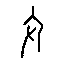 | 3 | 24403 | 出二 | □□卜，即鼎（貞）：⟨▢⟩…于⟨▢⟩。四月。 |
| 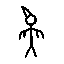 | 3 | 10495 | 賓出 | …往逐燕。 …翼（翌）日…王… |
| 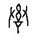 | 3 | 1439 | 典賓A？ | 甲申卜，亘鼎（貞）：⟨▢⟩𠦪（禱）于大甲。 |

### 2 次：28 个

| 字形 | 出现 | 片号 | 类组 | 《合集》释文 |
|---|---|---|---|---|
| 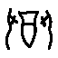 | 2 | 1464 | 師賓間？ | 大甲⟨▢⟩王。 |
|  | 2 | 2828 | 賓出 | 甲□〔卜〕，鼎（貞）：…⟨▢⟩… 二 丁子（巳）卜，鼎（貞）：㞢于帚（婦）小⟨▢⟩。 一 |
| 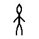 | 2 | 4406 | 師賓間 | 壬□卜：■四月※不其至。 |
| 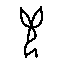 | 2 | 30442 | 何組 | ■其冓（遘）雨。 □□卜：※（巂？）…⟨▢⟩…王⟨▢⟩（賓）… |
|  | 2 | 10063 | 典賓—賓出 | …⟨▢⟩…它… 二 |
| qpe695ed6v | 2 | 6545 | 典賓B | …徝伐⟨▢⟩〔方〕… …⟨▢⟩… |
| 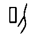 | 2 | 6595 | 典賓B | 鼎（貞）：乎（呼）行取龔友于⟨▢⟩，庶以。 |
|  | 2 | 6910 | 典賓B晚 | 癸酉卜，𡧊（賓）鼎（貞）：我㚔⟨▢⟩。 |
| 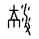 | 2 | 7032 | 賓一 | □□卜，鼎（貞）：我叀（惠）※𦎫。 |
| 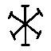 | 2 | 10507 | 賓出 | 辛□〔卜〕…王…⟨▢⟩… 一 |
|  | 2 | 9796 | 典賓B | …柲受年。 |
| 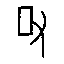 | 2 | 10409 | 賓一 | …■隻（獲）兕五，⟨▢⟩于東。十二月。 甲子卜，㱿〔鼎（貞）〕：… |
| 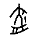 | 2 | 11467 | 師賓間 | 辛酉卜：方其⟨▢⟩東。 一 二 二告 |
| 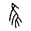 | 2 | 14049 | 典賓B | …娩…⟨▢⟩。 鼎（貞）：不隹（唯）孽。 一 二告 …一月。 |
|  | 2 | 15410 | 賓出 | …鼎（貞）：用宁（賈）。 |
|  | 2 | 17919 | 賓一 | 庚午〔卜〕，㱿鼎（貞）：□⟨▢⟩其… ⟨▢⟩亡其…𩁹… |
| 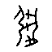 | 2 | 17970 | 賓出 | 丁丑卜，□鼎（貞）：…※于… □亥卜，□鼎（貞）：元…㞢（有）求（咎）…于… |
| 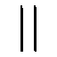 | 2 | 19621 | 賓三 | □□〔卜〕，𡧊（賓）鼎（貞）：…⟨▢⟩⟨▢⟩…火。 |
|  | 2 | 20298 | 師小字 | 癸酉卜，〔⟨▢⟩〕，豕王⟨▢⟩。 |
|  | 2 | 24246 | 出二 | 鼎（貞）：亡尤。才（在）十二月。才（在）⟨▢⟩卜。 二 |
| 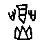 | 2 | 24355 | 出二 | □午卜，王。才（在）十二月。〔才（在）〕※山卜。 |
| 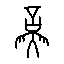 | 2 | 20822 | 師小字 | 辛未〔卜〕…⟨▢⟩。今十二月。 二 辛未卜，于乙亥⟨▢⟩。 一 二 |
| 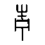 | 2 | 32277 | 歷二A1 | 𠂤般※（以）人于北奠⟨▢⟩。 人于⟨▢⟩⟨▢⟩。 于⟨▢⟩⟨▢⟩。 癸亥，伐即〔日〕，于〔丁〕卯。 |
|  | 2 | 32512 | 歷二B3 | 于來乙。 二 癸未鼎（貞）：叀（惠）今乙酉又⟨▢⟩歲于且（祖）乙五豲。 茲用 二 |
| 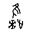 | 2 | 32832 | 歷二B1 | 辛酉鼎（貞）：王令⟨▢⟩※（以）子方奠于并。 辛未鼎（貞）：王其⟨▢⟩于人（？）。 于壬⟨▢⟩十。 □申鼎（貞）：…禾于□，〔尞〕三 |

### 1 次：161 个

（略，见 `handoff/inventory.json` 全量数据）

## 四、优先攻关建议

按「材料条件」排序，建议优先考虑下列字：

| 优先 | 字形 | 出现 | 类组 | 理由 |
|---|---|---|---|---|
| 1 |  | 140 | 賓一 | 出现 140 次、类组单一、已有原拓 |
| 2 |  | 71 | 典賓B | 出现 71 次、类组单一、已有原拓 |
| 3 |  | 54 | 事何類 | 出现 54 次、类组单一、已有原拓 |
| 4 |  | 40 | 出二 | 出现 40 次、类组单一、已有原拓 |
| 5 | mepmffeebh | 37 | 典賓B | 出现 37 次、类组单一、已有原拓 |
| 6 |  | 26 | 出二 | 出现 26 次、类组单一、已有原拓 |
| 7 |  | 20 | 典賓B | 出现 20 次、类组单一、已有原拓 |
| 8 |  | 19 | 典賓B | 出现 19 次、类组单一、已有原拓 |
| 9 | eadbesllam | 17 | 師小字 | 出现 17 次、类组单一、已有原拓 |
| 10 |  | 12 | 師小字 | 出现 12 次、类组单一、已有原拓 |
| 11 |  | 9 | 典賓B | 出现 9 次、类组单一、已有原拓 |
| 12 | uhz6qrd2d9 | 6 | 典賓 | 出现 6 次、类组单一、已有原拓 |
| 13 |  | 6 | 師小字 | 出现 6 次、类组单一、已有原拓 |
| 14 |  | 6 | 無名組 | 出现 6 次、类组单一、已有原拓 |
| 15 |  | 5 | 師賓間 | 出现 5 次、类组单一、已有原拓 |

## 五、如何使用本包

```
handoff/inventory.json      全量数据（243 条，含片号、类组、释文、拓片名）
data/rubbings/*.png         原拓图（322 片，文件名＝《合集》片号补零 6 位）
result/                     本会话各项分析结果
gxds2.py                    《合集》释文＋类组抓取器（可继续扩充）
```
原拓的直接 URL 格式（可自行续取）：
```
https://pic2.39017.com/jgwhj/1/0<片号，补零至 6 位>.png
```

## 六、本会话已确证的事实（供接手者参考）

1. **片号桥接**：OBIMD 片号 `H<n>` ↔《合集》编号 `n`，已验 5 片。
2. **编码缺失**：本数据集的「未释字」中混有**《合集》已给出读法**的字，
   已核实 9 例（黃、安、娩、西、龜、宓、丘、豲）。
   其中「娩」有数据集**内部不一致**的直接证据：
   同一句「貞二月□不其生」，OBIMD 在 18 处认作「娩」，独在《合集》17382 标为未释。
3. **真未释字**：（54 次，事何類专有）经确证为学界真正未释——
   《合集》亦只能以私用区码位 U+E123／U+E124 占位而无法隶定。
4. **摹本会规整化磨损处**： 的中部在原拓作三角／帳篷形，摹本作方框。
   **凡构形判断必须回到原拓。**
5. **字形相似度度量在本语料上无判别力**：七套度量一致失败，
   根因是跨类差异与同类变异同量级（同字不同形 IoU：中 0.151、史 0.068、目 0.181；
   跨类最高 IoU：冊 0.241）。

## 七、本会话未完成的事（诚实交代）

**本会话未能考释出任何一个甲骨文未释字。**
目标要求构建「甲骨→金文→篆字形链 ＋ 辞例验证 ＋ 音韵通假」三类完整证据链，
达到中国文字博物馆一等奖水平——**本会话未对任何一字完成此类论证**。

根本原因：**甲骨文生僻字的目验辨认需要长期专业训练。**
本会话在取得原拓后仍无法可靠辨认待考字（能认出「王」「貞」「卜」等常见字，
但认不出结构复杂的生僻字），而待考字全部是生僻字。
这不是数据问题，也不是可规模化的统计方法所能替代。
